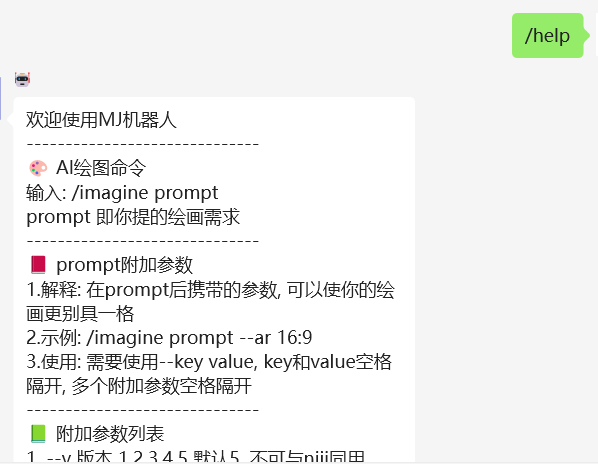
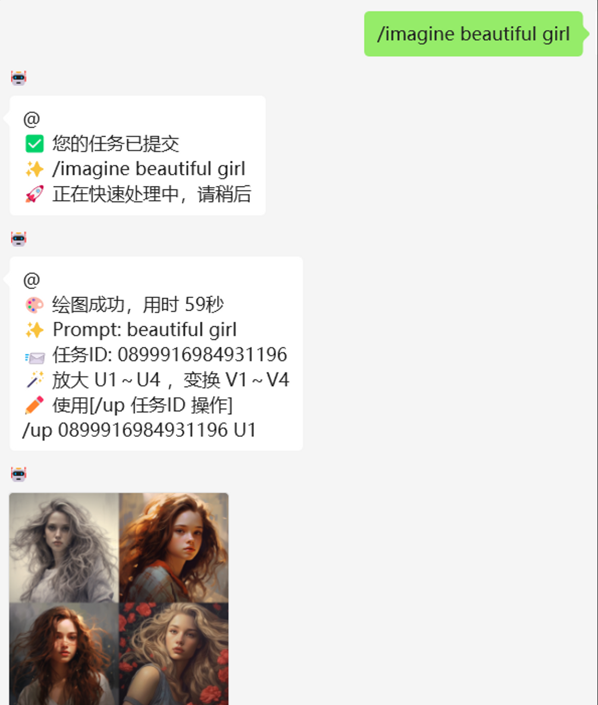

> 该教程分为两部分，一部分是搭建MJ代理服务器， 另一部分是搭建微信机器人


## MidJourney代理服务器

github仓库：

```jsx
https://github.com/novicezk/midjourney-proxy
```

<aside>
💡 内容： 代理 MidJourney 的discord频道，实现api形式调用AI绘图

</aside>

**使用前提:**

1. 注册 MidJourney，创建自己的频道，参考 [https://docs.midjourney.com/docs/quick-start](https://docs.midjourney.com/docs/quick-start)
2. 获取用户Token、服务器ID、频道ID：[获取方式](https://github.com/novicezk/midjourney-proxy/blob/main/docs/discord-params.md)
   - mj.discord.guild-id：discord服务器ID
   - mj.discord.channel-id：discord频道ID
   - mj.discord.user-token：discord用户Token
3. 一台国外服务器（国内也行，需要科学上网）


**操作流程：**

- 下载镜像（如果服务器不可以连接外网，可能会失败，请用压缩包的形式加载镜像）：

```bash
docker pull novicezk/midjourney-proxy:2.3
```

- 启动容器：

```bash
# 模板
# xxx中填写自己的信息
docker run -d --name midjourney-proxy \
 -p 8080:8080 \
 -e mj.discord.guild-id=xxx \
 -e mj.discord.channel-id=xxx \
 -e mj.discord.user-token=xxx \
 --restart=always \
 novicezk/midjourney-proxy:2.3

# 如果MJ代理和微信机器人都在一台服务器，则不需要设置回调地址
docker run -d --name midjourney-proxy \
 -p 8080:8080 \
 -e mj.discord.guild-id=1118085406467047456 \
 -e mj.discord.channel-id=1119965346074472478 \
 -e mj.discord.user-token=MTExNzc3MTA4NzE3NDk1OTExNg.GA0FuH.CPMJp7ZhigApKMslHGVOXVsoRei5iW99r8NwZI \
 --restart=always \
 novicezk/midjourney-proxy:2.3

# 如果MJ代理和微信机器人不在一台服务器，则需要设置回调地址
# mj.notify-hook=微信机器人服务器ip:4120
docker run -d --name midjourney-proxy \
 -p 8080:8080 \
 -e mj.discord.guild-id=1118085406467047456 \
 -e mj.discord.channel-id=1119965346074472478 \
 -e mj.discord.user-token=MTExNzc3MTA4NzE3NDk1OTExNg.GA0FuH.CPMJp7ZhigApKMslHGVOXVsoRei5iW99r8NwZI \
 -e mj.notify-hook=47.115.206.2:4120\
 --restart=always \
 novicezk/midjourney-proxy:2.3
```

​	更多配置信息：[https://github.com/novicezk/midjourney-proxy/wiki/配置项](https://github.com/novicezk/midjourney-proxy/wiki/%E9%85%8D%E7%BD%AE%E9%A1%B9)

- 查看接口：浏览器输入 [http://ip](http://ip/):port/mj （填写MJ代理服务器的ip和port)

​		例如：如果服务器在本地应为  [http://localhost:8080/mj/](http://localhost:8080/mj/)


# wechat-midjourney微信机器人

基于 [wechaty](https://github.com/wechaty/wechaty) 代理微信客户端，接入 MidJourney。

<aside>
💡 ***微信代理有风险，使用需谨慎***

</aside>

## 注意事项

- 依赖 [midjourney-proxy](https://github.com/novicezk/midjourney-proxy) 提供的api接口
- 需要使用Docker
- 需要一台国外服务器（国内也行，需要科学上网）


**具体操作：**

- 下载镜像（如果服务器不可以连接外网，可能会失败，请用压缩包的形式加载镜像）：

```bash
docker pull novicezk/wechat-midjourney:2.0.2
```

- 启动容器

```bash
# 如果MJ代理和微信机器人都在一台服务器
docker run -d --name wechat-midjourney \
 -p 4120:4120 \
 -e MJ_PROXY_ENDPOINT=http://172.17.0.1:8080/mj \
 -e MJ_NOFIFY_HOOK=http://172.17.0.1:4120/notify \
 --restart=always \
 novicezk/wechat-midjourney:2.0.2

# 如果MJ代理和微信机器人不在一台服务器，则需要设置回调地址
# MJ_PROXY_ENDPOINT=http://MJ代理服务器ip:8080/mj
# MJ_NOFIFY_HOOK=http://自己服务器ip:4120/notify \
# TODO :但是这样配置，似乎微信可以返回生成图片成功的信息，但是不返回图片,笔者嫌麻烦就跳过了没解决
docker run -d --name wechat-midjourney \
 -p 4120:4120 \
 -e MJ_PROXY_ENDPOINT=http://172.245.57.219:8080/mj \
 -e MJ_NOFIFY_HOOK=http://47.115.206.2:4120/notify \
 --restart=always \
 novicezk/wechat-midjourney:2.0.2
```

- 查看启动日志，微信扫描二维码，若二维码无法扫码，复制二维码链接浏览器打开扫码

```bash
docker logs -f -n 200 wechat-midjourney

# 或者
docker logs -f  wechat-midjourney
```

- 扫码用户所在的微信群内，发送/help即可获取使用帮助，返回一大段指南，说明微信机器人搭建成功



​	此时如果和MJ代理对接好，就可以使用了：

​		


